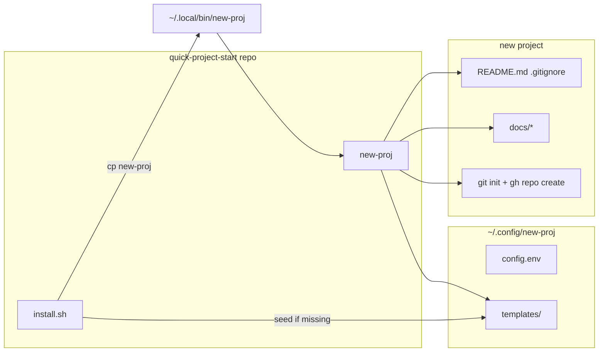

# new-proj architecture

## Product intent

- Bash CLI that scaffolds a new coding project under a configurable base directory (default `~/Documents/coding-temp`).
- Each run creates a local git repo, an `init` commit on `main`, and (when `gh` is available and authenticated) a public GitHub repo with an initial push.
- New projects get agent-oriented docs under `docs/` (or `SCAFFOLD_DIR_NAME`) plus a lean root `README.md` and `.gitignore`, copied from user templates in `~/.config/new-proj/templates/`.
- This repo (`quick-project-start`) is the versioned source for `new-proj` and `install.sh`; it is not installed in place — `install.sh` copies the script to `~/.local/bin`.

## Repository layout

```
quick-project-start/
  new-proj          # CLI: create project dir, copy templates, git + gh
  install.sh        # Install new-proj globally; seed ~/.config/new-proj if missing
  README.md         # Human-facing usage for this repo
  tests/            # ./tests/run-tests.sh
  docs/
    AGENT.md        # Agent rules for work in this repo
    ARCHITECTURE.md # This file
    DEPLOY.md       # Install / update flow
    TODO.md         # Open decisions for this tool
```

## Runtime layout (after install)

| Path | Role |
|------|------|
| `~/.local/bin/new-proj` | Installed copy of `new-proj` (from last `./install.sh`) |
| `~/.config/new-proj/config.env` | Defaults: `SCAFFOLD_DIR_NAME`, optional `BASE_DIR`, `TEMPLATES_DIR` |
| `~/.config/new-proj/templates/` | `AGENT.md`, `ARCHITECTURE.md`, `README.md`, `DEPLOY.md`, `TODO.md`, `.gitignore` — copied into each new project |

Per-run env overrides: `NEW_PROJ_BASE_DIR`, `NEW_PROJ_SCAFFOLD_DIR_NAME`, `NEW_PROJ_TEMPLATES_DIR`, `NEW_PROJ_CONFIG_FILE`.

## What `new-proj` creates

For `new-proj "my-app"` with defaults:

```
~/Documents/coding-temp/my-app/
  README.md              # from templates (project root, not under docs/)
  .gitignore
  docs/
    AGENT.md
    ARCHITECTURE.md      # empty template unless customized in ~/.config
    DEPLOY.md
    TODO.md
```

If `git` / `gh` are missing or `gh repo create` fails, the directory and files are still created; warnings are printed.

## Flow



## Decisions

- **Stack**: Bash only; no runtime dependencies beyond `git` and optional `gh`.
- **Templates live outside the repo** after first `install.sh`, so each machine can customize defaults without this repo overwriting them.
- **This repo’s `docs/`** document this tool only; `install.sh` does not read or write them.
- **Tests**: `tests/run-tests.sh` uses isolated `HOME`, temp base/templates dirs, and a fake `gh` on `PATH`.
- **`README.md` at project root** for new projects; other scaffold files stay under `docs/`.
- **AGENT.md in `new-proj`** still embeds a fallback heredoc if global templates are empty (e.g. script copied without running `install.sh`).
