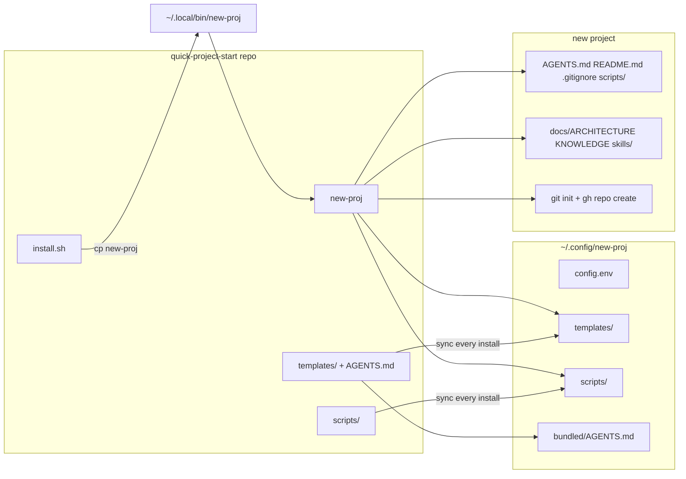

# new-proj architecture

## Product intent

- Bash CLI that scaffolds a new coding project under a configurable base directory (default `~/Documents/coding-temp`).
- Each run scaffolds files from templates. By default it also creates a local git repo, an `init` commit on `main`, and (when `gh` is available and authenticated) a public GitHub repo with an initial push. Pass `--no-repo` to skip all git/GitHub steps.
- Pass `--existing` from inside an existing project directory to copy scaffold docs into the current folder; by default also runs git/GitHub setup (init if needed, commit scaffold, `gh repo create` named after the directory unless a project name is passed); pass `--no-repo` to skip git/GitHub; does not overwrite an existing root `README.md`, `AGENTS.md`, `KNOWLEDGE.md`, or `.gitignore`; does not delete legacy `docs/DEPLOY.md` or `docs/TODO.md` if present; does not change the shell cwd.
- Pass `--update` from anywhere inside an existing project to refresh the scaffold without deleting anything: always overwrites root `AGENTS.md` with the newest bundled template; adds any missing scaffold files (root `README.md`, `.gitignore`, `docs/ARCHITECTURE.md`, `docs/KNOWLEDGE.md`, files under root `scripts/`, empty `docs/skills/` if needed); never overwrites existing project-specific docs except `AGENTS.md`; never removes deprecated or extra files. Resolves project root via `git rev-parse --show-toplevel`, or by walking up to the nearest parent with `AGENTS.md` when not in a git repo. No git, GitHub, or `cd`.
- Pass `--agent-version` from anywhere inside an existing project to print the project's `AGENTS.md` version (last non-empty line, format `AGENTS.md version: X.Y.Z`) and the latest available version from the same template chain as `--update` (both lines on stderr). Exit 0 when they match, 1 when the project is missing a version, behind, or has no `AGENTS.md`.
- Root `AGENTS.md` ends with `AGENTS.md version: X.Y.Z` on the last line; bump semver whenever the template changes. Agents do not edit `AGENTS.md` in scaffolded projects — only this repo or `--update` changes it.
- Normal and `--no-repo` runs print a `cd` command on stdout (status on stderr). `install.sh` installs `~/.config/new-proj/shell-integration.zsh` and appends a `source` line to `~/.zshrc` when missing; that wrapper runs the binary and `eval`s the `cd` line in the interactive shell.
- New projects get root `AGENTS.md`, `README.md`, `.gitignore`, and `scripts/` from `~/.config/new-proj/` (refreshed on every `./install.sh`), plus project docs under `docs/` (or `SCAFFOLD_DIR_NAME`) from templates.
- This repo (`quick-project-start`) is the versioned source for `new-proj` and `install.sh`; it is not installed in place — `install.sh` copies the script to `~/.local/bin`.

## Repository layout

```
quick-project-start/
  new-proj          # CLI: create project dir, copy templates, git + gh
  install.sh        # Install new-proj globally; sync ~/.config/new-proj templates + scripts
  AGENTS.md         # Agent rules (repo root; Cursor convention)
  README.md         # Human-facing usage for this repo
  scripts/          # Scaffold scripts (e.g. sz.py) — synced by install.sh only, not under templates/
  templates/        # Doc templates copied by install.sh into ~/.config/new-proj/templates/
  tests/            # ./tests/run-tests.sh
  docs/
    ARCHITECTURE.md # This file
    KNOWLEDGE.md    # Hard-won lessons (agent-editable)
    skills/         # Per-project agent skills (this repo's own skills live here)
```

## Runtime layout (after install)

| Path | Role |
|------|------|
| `~/.local/bin/new-proj` | Installed copy of `new-proj` (from last `./install.sh`) |
| `~/.config/new-proj/config.env` | Defaults: `SCAFFOLD_DIR_NAME`, optional `BASE_DIR`, `TEMPLATES_DIR`, `SCRIPTS_DIR` |
| `~/.config/new-proj/templates/` | `AGENTS.md`, `ARCHITECTURE.md`, `KNOWLEDGE.md`, `README.md`, `.gitignore` — refreshed on every `./install.sh`; doc templates copied under scaffold dir |
| `~/.config/new-proj/scripts/` | e.g. `sz.py` — refreshed on every `./install.sh`; copied to project root `scripts/` |
| `~/.config/new-proj/bundled/AGENTS.md` | Refreshed on every `./install.sh`; source for `new-proj --update` AGENTS.md when not running from a checkout |

Per-run env overrides: `NEW_PROJ_BASE_DIR`, `NEW_PROJ_SCAFFOLD_DIR_NAME`, `NEW_PROJ_TEMPLATES_DIR`, `NEW_PROJ_SCRIPTS_DIR`, `NEW_PROJ_CONFIG_FILE`.

## What `new-proj` creates

For `new-proj "my-app"` with defaults:

```
~/Documents/coding-temp/my-app/
  AGENTS.md              # from templates (project root)
  README.md
  .gitignore
  scripts/
    sz.py                # code size stats (Python/TS)
  docs/
    ARCHITECTURE.md
    KNOWLEDGE.md
    skills/              # empty folder
```

`DEPLOY.md` and `TODO.md` are no longer scaffolded. Legacy projects may still have them; `--existing` and `--update` do not remove them.

If `git` / `gh` are missing or `gh repo create` fails, the directory and files are still created; warnings are printed.

## Install and update

Distribution: clone this repo, run `install.sh`, use the global `new-proj` command.

Prerequisites: macOS or Linux with Bash; `git`; optional `gh` logged in (`gh auth login`); `~/.local/bin` on `PATH`.

First-time install:

```bash
cd /path/to/quick-project-start
./install.sh
```

This copies `new-proj` → `~/.local/bin/new-proj`, creates `~/.config/new-proj/config.env` if missing, syncs templates into `~/.config/new-proj/templates/`, syncs scripts into `~/.config/new-proj/scripts/`, and refreshes `bundled/AGENTS.md`.

Update after `git pull`:

```bash
git pull
./install.sh
```

Every `./install.sh` refreshes the binary, `bundled/AGENTS.md`, `~/.config/new-proj/templates/`, and `~/.config/new-proj/scripts/` from this repo. No separate manual copy step.

To refresh an **existing project** after install: `cd` into that project and run `new-proj --update`.

Customize defaults via `~/.config/new-proj/config.env` (`SCAFFOLD_DIR_NAME`, optional `BASE_DIR`, `TEMPLATES_DIR`, `SCRIPTS_DIR`) or per-run env overrides (`NEW_PROJ_BASE_DIR`, etc.).

## Flow



## Decisions

- **Stack**: Bash only; no runtime dependencies beyond `git` and optional `gh`. Scaffold utility `scripts/sz.py` uses Python 3 stdlib only.
- **Templates synced on every install** so `git pull && ./install.sh` is enough for new projects to get the latest policy; no stale `~/.config/new-proj/templates/` drift.
- **Scripts live outside `templates/`** in this repo (`scripts/` at repo root) and sync to `~/.config/new-proj/scripts/` via `install.sh` only — not mixed with doc templates.
- **This repo's `docs/`** hold project docs; **`AGENTS.md` at repo root** holds agent rules editable only here (or via `--update` in other projects).
- **Tests**: `tests/run-tests.sh` uses isolated `HOME`, temp base/templates dirs, and a fake `gh` on `PATH`.
- **`AGENTS.md` and `README.md` at project root** for new projects; `ARCHITECTURE.md` and `KNOWLEDGE.md` under `docs/` (or `SCAFFOLD_DIR_NAME`); `docs/skills/` created empty; root `scripts/` copied from `~/.config/new-proj/scripts/`.
- **`new-proj`** seeds `AGENTS.md` from repo `AGENTS.md` when run from a checkout, else from `~/.config/new-proj/templates/`, else an embedded fallback heredoc.
- **`--existing`**: target is `pwd`; no project name required (GitHub repo name defaults to directory basename); runs git/GitHub unless `--no-repo`; skips `gh repo create` when `origin` is already set or the named GitHub repo already exists (links origin and pushes instead).
- **`--update`**: additive refresh for existing projects; overwrites only `AGENTS.md`; never deletes files.
