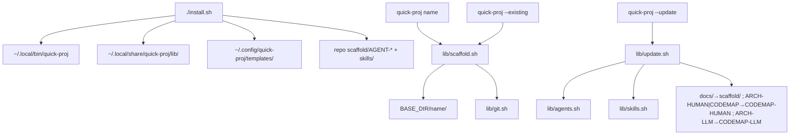

# Code map

Map of `quick-project-start` / the `quick-proj` CLI: files, flows, where config and templates live.

## Layout

```
quick-project-start/
  quick-proj              # CLI entry: arg parse + dispatch; defines SCAFFOLD_DOC_FILES
  lib/
    config.sh             # paths, scaffold dir name, project-root find, migrations
    version.sh            # --agent-version
    agents.sh             # copy/seed AGENT-COMMS.md + AGENT-WORKFLOW.md
    skills.sh             # templates/skills/ → project scaffold/skills/
    scaffold.sh           # create / --existing file layout
    update.sh             # --update
    git.sh                # optional git + gh
  install.sh              # install CLI + lib/; sync templates/; refresh this repo's scaffold/AGENT-*
  templates/              # product source (rules, skills, blank project stubs)
    AGENT-COMMS.md
    AGENT-WORKFLOW.md     # ends with scaffold version: X.Y.Z
    CODEMAP-HUMAN.md            # blank-project stub for maintainer code map
    CODEMAP-LLM.md           # blank-project stub for agent architecture
    skills/               # base skills shipped to every project
    README.md AGENTS.md .gitignore sz.py
  scaffold/               # this repo's own docs + synced agent-rule/skill copies
  tests/                  # run-tests.sh + helpers; fake HOME / gh
```

## Runtime (after `./install.sh`)

| Path | Role |
|------|------|
| `~/.local/bin/quick-proj` | Installed entrypoint |
| `~/.local/share/quick-proj/lib/` | Installed modules |
| `~/.config/quick-proj/config.env` | `SCAFFOLD_DIR_NAME`, optional `BASE_DIR`, `TEMPLATES_DIR` |
| `~/.config/quick-proj/templates/` | Synced from repo `templates/` every install |
| `~/.config/quick-proj/bundled/` | Legacy agent-rule mirror for older `--update` paths |

Per-run env overrides: `QUICK_PROJ_BASE_DIR`, `QUICK_PROJ_SCAFFOLD_DIR_NAME`, `QUICK_PROJ_TEMPLATES_DIR`, `QUICK_PROJ_CONFIG_FILE`.

## Flows



**New project / `--existing`:** `apply_scaffold_to_project` creates root `README.md`, `AGENTS.md`, `.gitignore`, `scripts/sz.py`, and under scaffold: agent rules, `CODEMAP-HUMAN.md`, `CODEMAP-LLM.md`, `skills/`. `--existing` keeps an existing root README/AGENTS and existing agent files.

**`--update`:** overwrites agent rules, root `AGENTS.md`, and managed skills; adds missing scaffold docs; never deletes project-local files; runs migrations above.

**Agent rules source order:** checkout `templates/` → installed `templates_dir` → `bundled/` → embedded stub (`0.0.0`).

## State

- Defaults / overrides: `config.env` and `QUICK_PROJ_*` env
- What every new project gets: files under `templates/` (including `templates/skills/`)
- Scaffold policy version: last line of `templates/AGENT-WORKFLOW.md` (`scaffold version: X.Y.Z`), copied into each project's `scaffold/AGENT-WORKFLOW.md`
